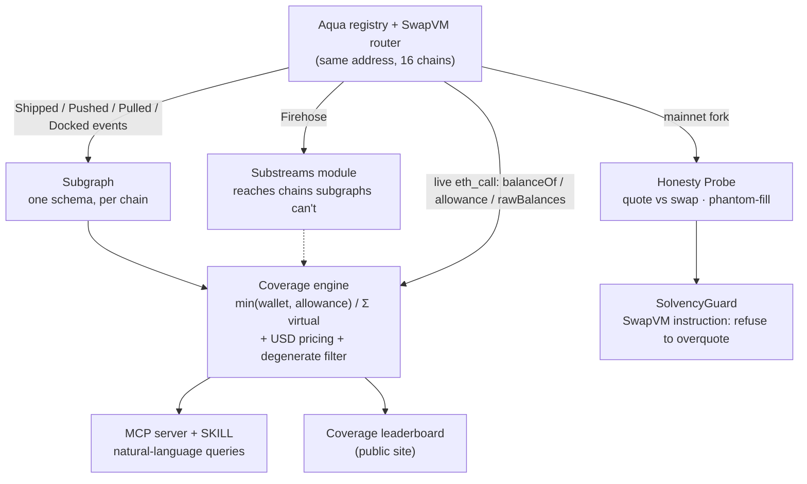

# Overdraft

**Measuring how much of 1inch Aqua's advertised liquidity actually exists.**

**▶ Live leaderboard: https://leonardoryuta.github.io/overdraft/**

On Aqua, one wallet balance can back many positions at once (virtual balances), so *quoted*
depth is an upper bound, not a guarantee. Overdraft computes, for every live position on every
chain, how much of that quoted depth is actually backed on-chain — and ships the SwapVM
instruction that stops positions overcommitting.

> **Preliminary finding (Ethereum, 2026-09-05, reproducible below):** across **35 live positions**,
> **$134,510** of quoted Aqua depth is backed by **$131,288** of real balance — leaving
> **$25,109 of phantom depth across 14 under-backed positions**. Separately, **7 positions advertise
> a virtual balance larger than their token's entire supply** (can never be backed). *No Aqua coverage
> tool exists today.* Full multi-chain number lands once the subgraph is live.

The core measurement, per `(maker, token)`:

```
coverage = min(wallet_balance, allowance→Aqua) / Σ virtual_balance_committed
phantom  = max(0, committed − backed)
```

## The finding

| chain | live positions | quoted (USD) | backed (USD) | coverage | phantom | under-backed |
|---|---|---|---|---|---|---|
| Ethereum | 35 real (+7 degenerate) | $134,510 | $131,288 | 97.6% | $25,109 | 14 / 35 |
| Base | ~127 (Agent C count) | — | — | — | — | *pending subgraph* |

Numbers are live and drift; regenerate them yourself (below). "Degenerate" = virtual balance exceeds
the token's total supply, excluded from the headline. One concrete example the naive tools miss: a WETH
leg holding 2.06 WETH but with only ~1.0 WETH approved to Aqua → **allowance-bound at 69%**, not
wallet-bound. Wallet-only coverage tools report ~100% and miss it.

## Why this exists

**Virtual balances.** Aqua is a registry, not a pool — tokens stay in the maker's wallet; the contract
stores allowance records. $100k can quote $300k. That's the feature.

**Immutability.** Aqua strategies are immutable once shipped. A misconfigured or under-backed position
can't be edited — only docked or left to run.

**No tooling.** Quoted depth is published; backed depth is not. The ratio between them is a position's
real solvency, and nobody computes it. Aqua's eight audits cover the contracts; they don't cover
whether a maker's wallet can honour what its positions advertise.

## Status (Day 2 of 9 — ETHOnline 2026, ships Sept 13)

| Component | Status |
|---|---|
| Coverage engine (`packages/coverage`) | ✅ live reads + USD pricing + spam classification, reproducible |
| Subgraph (`indexer/subgraph`) | ✅ builds clean, deploy-ready — awaiting Studio key to go live |
| Substreams (`indexer/substreams`) | ✅ builds to `.spkg` — reaches Firehose-only chains subgraphs can't |
| Probe harness (`contracts/`) | ✅ fork cross-check + taker impersonation · 🔨 full quote-vs-swap in progress |
| SolvencyGuard SwapVM instruction | 📋 next |
| MCP server + SKILL | 📋 planned |
| Coverage leaderboard (web) | 📋 planned |

## Architecture



- **Index** — Subgraph + Substreams on one schema (The Graph, both tracks).
- **Diagnose** — the coverage engine joins subgraph-enumerated *quoted* depth with live-read
  *backed* depth into a per-`(maker, token)` ratio.
- **Verify** — a Foundry/anvil fork probe proves quote-vs-execution divergence and phantom fills.
- **Fix** — `SolvencyGuard`, a custom SwapVM instruction, makes a position refuse to quote
  beyond real backing.
- **Serve** — an MCP server (+ SKILL) and a public leaderboard over the same data.

## Verify our claims

```bash
# reproduce the Ethereum coverage scan + headline number (keyless: Blockscout + public RPC + DefiLlama)
cd packages/coverage && npm install && node src/run.js --chain ethereum --deep

# reconstruct a real position's Order from on-chain Shipped bytes (verifies keccak256(strategy)==strategyHash)
cd spikes/order && npx tsx recover-order.mjs      # needs spikes/sdk/node_modules

# on-chain coverage cross-check on a mainnet fork (Foundry)
cd contracts && forge test -vv
```

## Where the code is

- **Coverage engine:** `packages/coverage/src/{coverage,reader,enumerate,pricing}.js`
- **1inch / SwapVM:** `contracts/test/Probe.t.sol` (fork reads + impersonation); Order recovery in `spikes/order/`, `RECON-ORDER.md`
- **The Graph:** `indexer/subgraph/` (schema + mappings) and `indexer/substreams/` (Rust module, one schema per chain)
- **Recon (cited):** `RECON-PROTOCOL.md`, `RECON-SDK.md`, `RECON-DATA.md`, `RECON-ORDER.md`, `PRIOR-ART.md`

## Prior art (and how this differs)

- **`marcos-golem/aqua-arkiv-indexer`** — computes a per-maker coverage ratio too, but **wallet-only**
  (not `min(wallet, allowance)`), off-chain, single-chain, and its own TODO admits it misses the drain case.
- **`ottodevs/doca`** (ex-plimsoll) — a SwapVM *fee* provider that reads virtual balances only and never
  refuses a quote; its README even sketches an unbuilt `IBudgetGuard` — which is our SolvencyGuard.
- **Sluice** (ETHGlobal Lisbon) — safe strategy *authoring* (before creation); Overdraft inspects what's
  *already deployed*.
- 1inch's own keyless `aqua` MCP exposes strategy listing + volume — but not `min(wallet,allowance)`
  coverage, fork verification, or an on-chain guard.

## What's next

Full multi-chain headline via the live subgraph · the SolvencyGuard instruction (quote ceiling from real
backing) with an on-chain fork execution · an MCP server + SKILL to query coverage in natural language.
