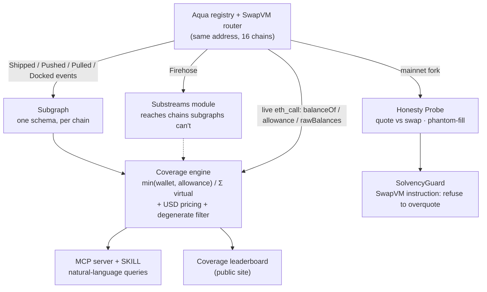

# Overdraft

**Measuring how much of 1inch Aqua's advertised liquidity actually exists.**

**▶ Live leaderboard: https://leonardoryuta.github.io/overdraft/**

On Aqua, one wallet balance can back many positions at once (virtual balances), so *quoted*
depth is an upper bound, not a guarantee. Overdraft computes, for every live position on every
chain, how much of that quoted depth is actually backed on-chain — and ships the SwapVM
instruction that stops positions overcommitting.

> **Finding (Ethereum, full population via live subgraph, 2026-09-07):** across **1,485 active
> positions**, only **6.3%** of the **$25.3M** quoted Aqua depth is actually backed (**$1.6M**) —
> **$23.9M is phantom**, across **1,046 under-backed positions**. Most under-backed makers hold
> *zero* of the token they committed: they ship a position and approve the protocol, but never fund
> the wallet. On a five-week-old, incentive-seeded protocol that is expected — and it is exactly why
> advertised depth ≠ real depth, and why the quoted number can't be trusted at face value.
> *No other Aqua coverage tool exists.* Every figure is verified against on-chain `rawBalances`.

The core measurement, per `(maker, token)`:

```
coverage = min(wallet_balance, allowance→Aqua) / Σ virtual_balance_committed
phantom  = max(0, committed − backed)
```

## The finding

| chain | active positions | quoted (USD) | backed (USD) | coverage | phantom | under-backed |
|---|---|---|---|---|---|---|
| Ethereum | 1,485 (+11 degenerate) | $25.3M | $1.6M | **6.3%** | **$23.9M** | 1,046 |
| Base | 134 | $88K | $45K | 51.7% | $71K | 75 |

Both chains run on **live Studio subgraphs** — one schema, redeployed per network (`overdraft`,
`overdraft-base`). Coverage varies sharply by chain: Base's makers are far better funded than
Ethereum's. (Base's count independently matches a keyless Blockscout full-sweep — two enumeration
paths agree.)

Live from the Studio subgraph; regenerate yourself (below). **How to read it:** the biggest single
position commits **2,420 WETH + 4.44M USDC**, approves Aqua at max, and holds **$0** — pure phantom.
Most under-backed positions are unfunded like this (a young, incentive-seeded protocol). "Degenerate" =
virtual balance exceeds the token's total supply (excluded from the headline). Coverage is `min(wallet,
allowance)` — so we also catch *allowance-bound* positions that wallet-only tools miss.

## Why this exists

**Virtual balances.** Aqua is a registry, not a pool — tokens stay in the maker's wallet; the contract
stores allowance records. $100k can quote $300k. That's the feature.

**Immutability.** Aqua strategies are immutable once shipped. A misconfigured or under-backed position
can't be edited — only docked or left to run.

**No tooling.** Quoted depth is published; backed depth is not. The ratio between them is a position's
real solvency, and nobody computes it. Aqua's eight audits cover the contracts; they don't cover
whether a maker's wallet can honour what its positions advertise.

## Status (Day 4 of 9 — ETHOnline 2026, ships Sept 13)

| Component | Status |
|---|---|
| Coverage engine (`packages/coverage`) | ✅ live reads + USD pricing + degenerate classification |
| Subgraph (`indexer/subgraph`) | ✅ **live on Subgraph Studio**, synced, powering the headline |
| Substreams (`indexer/substreams`) | ✅ builds to `.spkg` — reaches Firehose-only chains subgraphs can't |
| Probe harness (`contracts/`, `packages/probe`) | ✅ fork coverage cross-check + quote-vs-swap + phantom-fill on a real position |
| SolvencyGuard SwapVM instruction | ✅ compiles + 4 fork tests + before/after payoff demo |
| MCP server + SKILL (`apps/mcp`) | ✅ 4 tools over live Graph data |
| Coverage leaderboard (`apps/web`) | ✅ deployed — https://leonardoryuta.github.io/overdraft/ |

## Architecture



- **Index** — Subgraph + Substreams on one schema (The Graph, both tracks).
- **Diagnose** — the coverage engine joins subgraph-enumerated *quoted* depth with live-read
  *backed* depth into a per-`(maker, token)` ratio.
- **Verify** — a Foundry/anvil fork probe proves quote-vs-execution divergence and phantom fills.
- **Fix** — `SolvencyGuard`, a custom SwapVM instruction, makes a position refuse to quote
  beyond real backing.
- **Serve** — an MCP server (+ SKILL) and a public leaderboard over the same data.

## Verify our claims

```bash
# reproduce the Ethereum coverage scan + headline number (keyless: Blockscout + public RPC + DefiLlama)
cd packages/coverage && npm install && node src/run.js --chain ethereum --deep

# reconstruct a real position's Order from on-chain Shipped bytes (verifies keccak256(strategy)==strategyHash)
cd spikes/order && npx tsx recover-order.mjs      # needs spikes/sdk/node_modules

# on-chain coverage cross-check on a mainnet fork (Foundry)
cd contracts && forge test -vv
```

## Where the code is

- **Coverage engine:** `packages/coverage/src/{coverage,reader,enumerate,pricing}.js`
- **1inch / SwapVM:** `contracts/test/Probe.t.sol` (fork reads + impersonation); Order recovery in `spikes/order/`, `RECON-ORDER.md`
- **The Graph:** `indexer/subgraph/` (schema + mappings) and `indexer/substreams/` (Rust module, one schema per chain)
- **Recon (cited):** `RECON-PROTOCOL.md`, `RECON-SDK.md`, `RECON-DATA.md`, `RECON-ORDER.md`, `PRIOR-ART.md`

## Prior art (and how this differs)

- **`marcos-golem/aqua-arkiv-indexer`** — computes a per-maker coverage ratio too, but **wallet-only**
  (not `min(wallet, allowance)`), off-chain, single-chain, and its own TODO admits it misses the drain case.
- **`ottodevs/doca`** (ex-plimsoll) — a SwapVM *fee* provider that reads virtual balances only and never
  refuses a quote; its README even sketches an unbuilt `IBudgetGuard` — which is our SolvencyGuard.
- **Sluice** (ETHGlobal Lisbon) — safe strategy *authoring* (before creation); Overdraft inspects what's
  *already deployed*.
- 1inch's own keyless `aqua` MCP exposes strategy listing + volume — but not `min(wallet,allowance)`
  coverage, fork verification, or an on-chain guard.

## What's next

Full multi-chain headline via the live subgraph · the SolvencyGuard instruction (quote ceiling from real
backing) with an on-chain fork execution · an MCP server + SKILL to query coverage in natural language.
